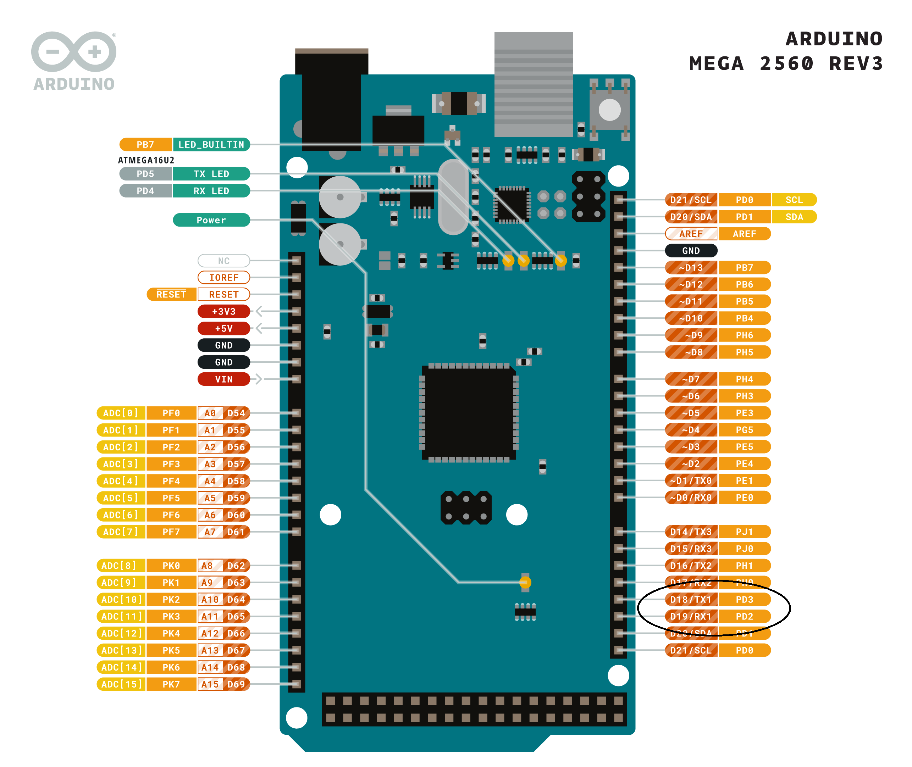

# UART Driver for TX RX 1 on Arduino ATmega

## Overview
This project provides a UART driver for the TX RX 1 pins on an Arduino ATmega microcontroller. The driver allows for serial communication between the microcontroller and other devices.

## Features
- Supports asynchronous serial communication
- Configurable baud rate
- Interrupt-driven receive and transmit
- Error detection and handling

## Pinout
Below is an image of the Arduino ATmega pinout with the TX RX 1 pins circled.



## Installation
1. Clone the repository to your local machine.

## Usage
1. Include the UART driver header file in your project.
2. Initialize the UART driver with the desired baud rate.
3. Use the provided functions to send and receive data.

```c
#include "uart1.h"

int main(void) {
    uart1_init(); // Initialize UART, Baud Rate 9600
    sei(); // Enable Interrupts

    char *received_str = uart1_rx_string(); // receive by calling rx function
    uart1_tx_string(received_str); // send the received string directly
}
```